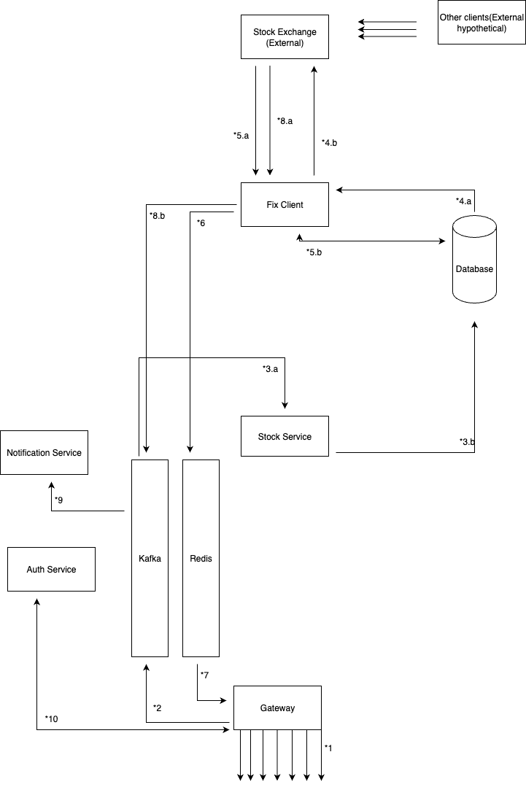

### Links for Services

- stock exchange => https://github.com/MuratKaracaa/exchange_poc
- fix_client => https://github.com/MuratKaracaa/fix_client
- stock_service => https://github.com/MuratKaracaa/stock_service

### Diagram flow explanations

## General Notes

- Messages published to kafka and redis are protobuf messages for size and performance efficiency. Custom deserializers are required
  depending on language and libraries

## Numeric explanations

- \*1- Users connect to our system via web sockets and HTTP requests (only mobile clients).
- \*2- New orders are dispatched to kafka.
- \*3.a- Stock Service consumes new orders.
- \*3.b- Stock Service writes new orders to database and creates an outbox message to be polled.
- \*4.a- Fix Client acts as relay for the order outbox messages.
- \*4.b- Fix Client transmits them to stock exchange via fix protocol.
- \*5.a- Fix client Market Updates via fix protocol.
- \*5.b- Fix client updates stock prices on database and creates outbox messages for the latest prices.
- \*6- Fix client acts as its own relay for the updates stocks prices and publishes them to via redis pub/sub.
- \*7- Gateway is subscribed to redis for latest price updates and publishes updates via websocket in each stocks own channel.
- \*8.a - Fix Client receives Execution Reports.
- \*8.b - Execution Reports are directly published to kafka.
- \*9 - Notification Service listens to Execution Reports, and notifies them
- \*10- For authentication, gateway communicates with Auth Service. For authorization, gateway accesses session data stored in distributed redis instance

### A&A Notes

## Authentication

- Username/password and biometric sign in will be supported.
- For untrusted devices, SMS verification will be required.
- For trusted devices, initially password will be required. After each sign in, a jwt with version and username will be sent to device
  for future biometrics login. Tokens are required to have expiration periods. If there is a version mismatch or token is expired, password sign in will be required again. Tokens are required to be stored securely on device.
- The id of a device will be stored on the Auth Service and with each sign in request device id will be checked.

## Authorization

- If the authentication is successfull, a session will be created on a centralized redis instance. Websocket connections or HTTP requests will require session id in headers.
- Only one session per user will be allowed. If a sign in request is received while there is still active session, old session will be destroyed.
- In the case of suspicious activity, existing session will be destroyed and the biometric token version will be converted to a pretedermined invalid number equivalent to prevent future sign ins via tokens. The existing trusted device will be marked as untrusted and SMS verification will be required again.
